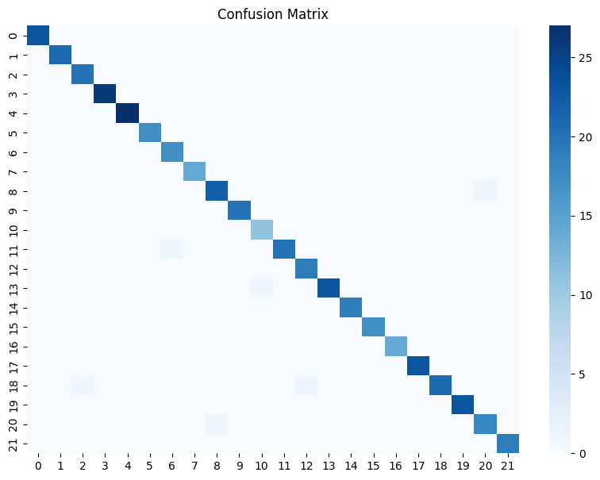
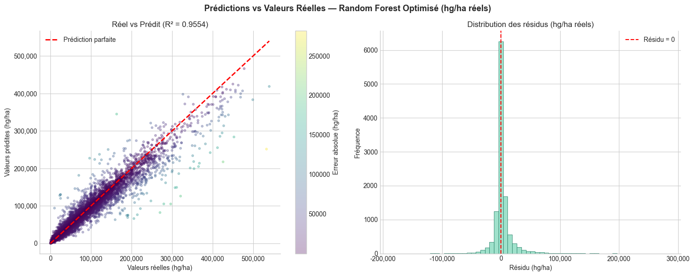
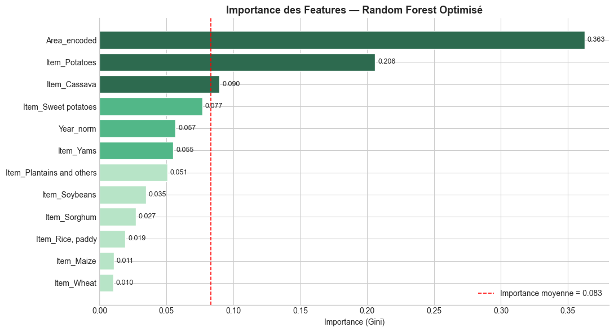
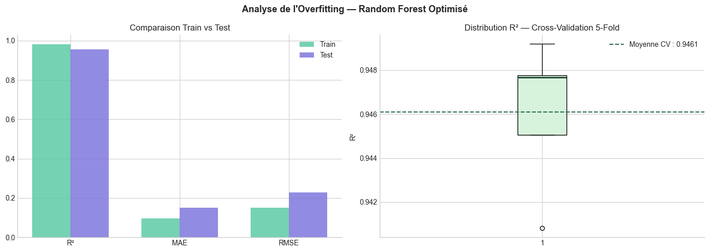
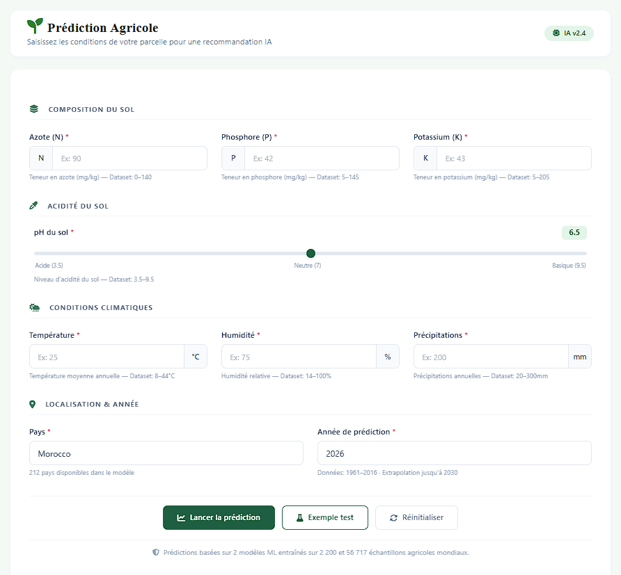
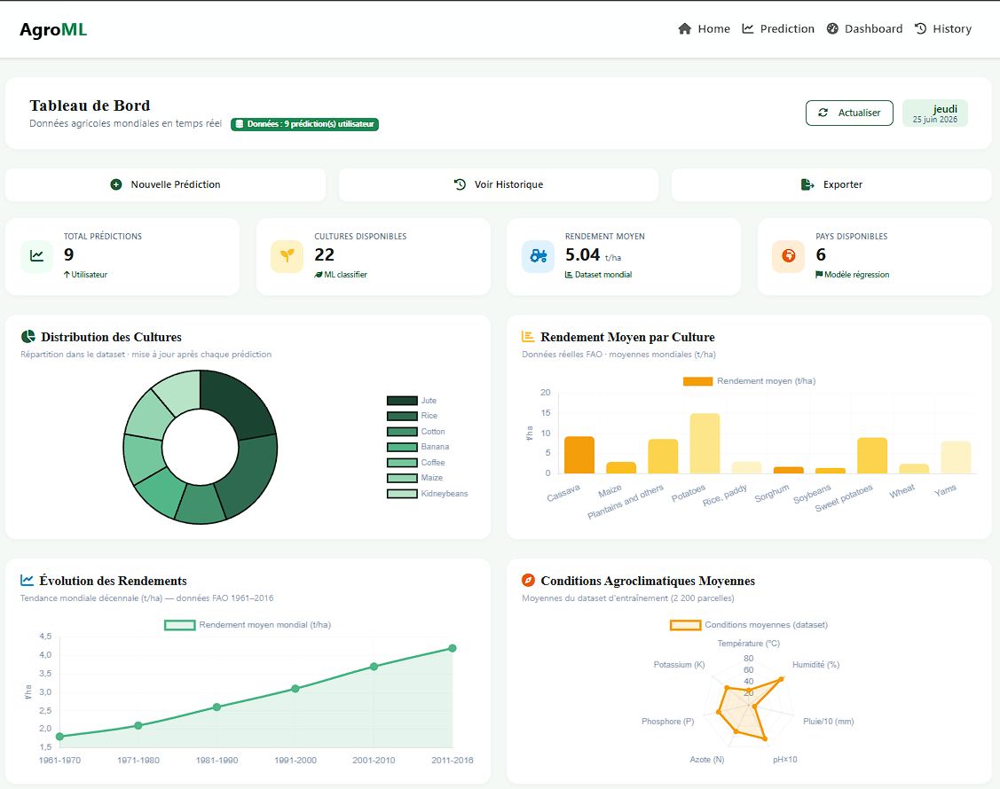
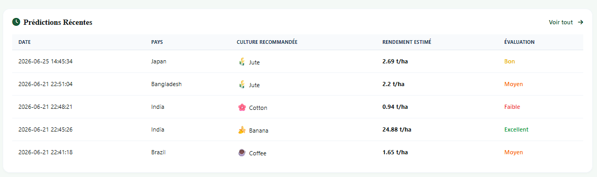
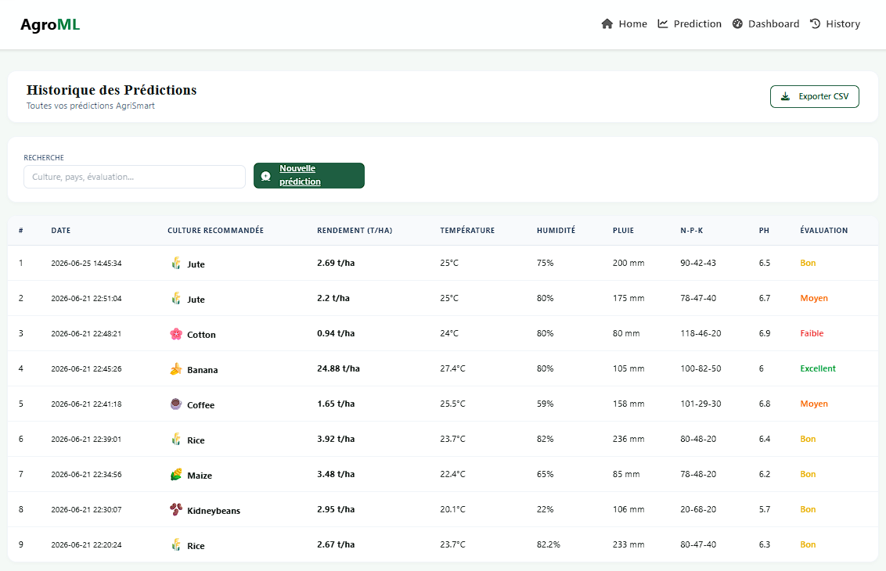

# 🌾 AgroML — Smart Farming: Crop Recommendation & Yield Prediction

<p align="center">
  
</p>

<p align="center">
  <b>Master d'Excellence en Intelligence Artificielle — M1</b><br>
  Université Hassan II de Casablanca — Faculté des Sciences Ben M'Sick<br>
  <i>Academic Year 2025–2026</i>
</p>

<p align="center">
  
  
  
  
  
  
</p>

---

##  About the Project

**AgroML** is an intelligent agricultural decision-support system powered by Machine Learning. It helps farmers make data-driven decisions by:

- 🌱 **Recommending the best crop** based on soil composition (N, P, K, pH) and climate conditions (temperature, humidity, rainfall) — *Classification task*
- 📈 **Predicting the expected yield** for a given crop in a specific country and year — *Regression task*

> Built as a final module project for the *Machine Learning* course, it addresses real-world challenges faced by modern agriculture: climate variability, heterogeneous soils, and lack of intelligent decision tools.

---

## 👩‍💻 Authors

| Name | Role |
|------|------|
| Mlle. EL MORCHAD Kaoutar | Student — M1 IA |
| Mlle. RHAOUFAL Khadija | Student — M1 IA |

**Supervisors:** Pr. BEN LAHMAR El Habib & Pr. HANNOUNI Salma

---

## 🗂️ Project Structure

```
AgroML-SmartFarming/
│
├── app.py                    # Flask application entry point
├── predictor.py              # Inference logic (classification + regression)
├── requirements.txt
│
├── models/                   # Trained ML models (.pkl)
│   ├── crop_classifier.pkl
│   ├── yield_regressor.pkl
│   ├── reg_feature_columns.pkl
│   └── reg_area_means.pkl
│
├── notebooks/                # Jupyter notebooks
│   ├── dataset1_crop_classification.ipynb
│   └── dataset2_yield_regression.ipynb
│
├── static/                   # CSS, JS, images
├── templates/                # Jinja2 HTML templates
│   ├── index.html
│   ├── prediction.html
│   ├── dashboard.html
│   └── history.html
│
└── assets/                   # Figures and screenshots
```

---

## 📦 Datasets

| | Dataset 1 — Classification | Dataset 2 — Regression |
|--|--|--|
| **Name** | Crop Recommendation | Crop Yield Prediction |
| **Source** | Kaggle | Kaggle (FAO) |
| **Size** | 2,200 rows × 8 columns | 56,709 rows × 12 columns |
| **Features** | N, P, K, Temperature, Humidity, pH, Rainfall | Crop, Region, Year, Yield (hg/ha) |
| **Target** | Crop label (22 classes) | Yield in hg/ha |

---

## ⚙️ ML Pipeline & Preprocessing

### Anti-Data Leakage Architecture

```
Raw Data
   │
   ▼
80/20 Train/Test Split (random_state=42)
   │
   ├── Train Set → Fit transformers (Scaler, Encoder)
   │                      │
   └── Test Set  ← Apply fitted transformers
                          │
                    Train Model → Evaluate on Test
```

### Dataset 1 — Classification Preprocessing
- Duplicate removal
- Agronomic bounds validation
- **RobustScaler** (robust to outliers, uses median + IQR)

### Dataset 2 — Regression Preprocessing
- Duplicate removal and cleaning
- **log1p transformation** on target (handles skewed yield distribution)
- **Target Encoding** for regions (computed on train only)
- **One-Hot Encoding** for crops
- Inverse transform at inference: `yield = exp(prediction) − 1`

---

## 🤖 Models

### Classification — Crop Recommendation
- **Algorithm:** Random Forest Classifier
- **Why RF?** Handles non-linear interactions, robust to outliers, interpretable via feature importance
- **Hyperparameters:** `n_estimators=100`, `max_depth=None` (scikit-learn defaults)

### Regression — Yield Prediction
- **Algorithm:** Random Forest Regressor
- **Why RF?** Same advantages + handles heterogeneous encoded features
- **Target:** log-transformed yield → inverse-transformed at inference

---

## 📊 Results

### Model Performance

| Module | Algorithm | Accuracy / R² | F1 / log-RMSE | Precision / MAE |
|--------|-----------|---------------|---------------|-----------------|
| Classification | Random Forest | **99.32% Acc.** | **0.99 F1** | **0.99 Prec.** |
| Regression | Random Forest Reg. | **0.98 R²** | **0.152 RMSE** | **10.07% MAE** |

> The regression MAE of **10.07%** means predictions deviate from true yield by ~10% on average — excellent for agricultural planning.

### Confusion Matrix (Classification)

<p align="center">
  
</p>

*Nearly perfect classification across all 22 crop classes.*

### Predicted vs. Real Yield (Regression)

<p align="center">
  
</p>

*Points closely follow the perfect prediction diagonal (R² = 0.98).*

### Feature Importance — Regression

<p align="center">
  
</p>

*Region encoding (`Area_encoded`) dominates, confirming that geographic location is the primary driver of yield.*

### Overfitting Analysis

<p align="center">
  
</p>

*Train vs. test performance gap is minimal — models generalize well.*

---

## 🖥️ Application Interface

### Home Page
<p align="center">
  
</p>

### Prediction Page
<p align="center">
  
</p>

*Users input soil composition (N, P, K, pH), climate conditions, country (212 available), and year (1961–2030).*

### Resulte Page
<p align="center">
  
</p>

### Dashboard
<p align="center">
  
</p>
<p align="center">
  
</p>

*Includes: crop distribution pie chart, average yield per crop, yield trend 1961–2016, agroclimatic radar chart.*

### History Page
<p align="center">
  
</p>

*Tracks all past predictions with export to CSV functionality.*

---

## 🚀 How to Run the App

### Prerequisites
- Python 3.10+
- pip

### 1. Clone the repository
```bash
git clone https://github.com/TON_USERNAME/AgroML-SmartFarming.git
cd AgroML-SmartFarming
```

### 2. Create a virtual environment
```bash
python -m venv venv
source venv/bin/activate        # Linux/Mac
venv\Scripts\activate           # Windows
```

### 3. Install dependencies
```bash
pip install -r requirements.txt
```

### 4. Run the Flask app
```bash
python app.py
```

### 5. Open in browser
```
http://localhost:5000
```

---

## 📋 Requirements

```
flask
scikit-learn
pandas
numpy
matplotlib
seaborn
joblib
category_encoders
```

> Full list in `requirements.txt`

---

## 🔬 Tech Stack

| Layer | Technologies |
|-------|-------------|
| **ML / Data Science** | Python, scikit-learn, pandas, NumPy, Matplotlib, Seaborn, Joblib |
| **Web Backend** | Flask (Python micro-framework) |
| **Web Frontend** | HTML5, CSS3, JavaScript, Bootstrap 5 |
| **IDE** | VS Code |
| **Version Control** | Git / GitHub |

---

## 🔭 Future Perspectives

- 🌦️ Real-time weather data integration via API
- 🛰️ Spatial remote sensing (satellite imagery)
- 🧠 Advanced Deep Learning models (LSTM, CNN)
- 🌍 Multi-region / multi-crop extension
- 💰 Economic module (market prices, ROI)
- 📡 IoT field sensors integration

---

## 📜 Master

This project was developed for academic purposes at **Université Hassan II de Casablanca — FSBM**.

---

<p align="center">
  Made with ❤️ by EL MORCHAD Kaoutar & RHAOUFAL Khadija
</p>
